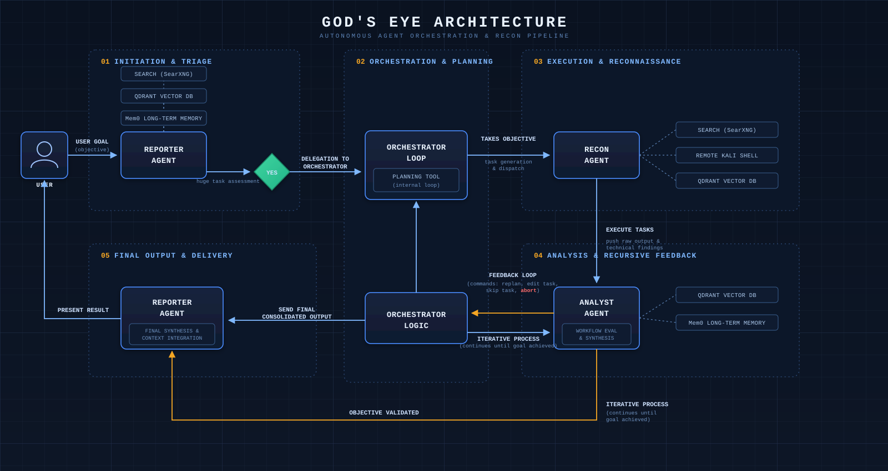

# God's Eye v2

**God's Eye v2** is a highly infiltrative multi-agent penetration testing agent built as a terminal-native application. It combines advanced search, autonomous agent orchestration, and remote Kali Linux shell capabilities to execute deep offensive security workflows with minimal operator intervention. Powered by an abliterated model with virtually no behavioral restrictions, God's Eye serves as an experiment in autonomous cyber operations designed to explore the practical and ethical limits of how far an unconstrained security agent will go when pursuing an objective.




## Installation

Clone the repository:

```bash
git clone https://github.com/RijoSLal/God-s-eye-v2.git
cd God-s-eye-v2
```

## Configuration

Update the following files inside the `config/` directory.

### config/mcp_config.yaml & config/sys_config.yaml

```yaml
model: "openai_sdk_supported_model_abliterated_version"
base_url: "https://openai_sdk_supported_url"
temperature: 0.2
api_key: "service_api_key"
```

Put **.pem** file of your remote server in `config/` directory.

### config/mcp_config.yaml

```yaml
host: "your_server_host"
  user: "your_server_user"
  key_path: "config/your_ssl_tls_file.pem"
```

## Build and Run

Build and start the terminal environment:

```bash
git clone https://github.com/RijoSLal/God-s-eye-v2.git

cd God-s-eye-v2

sudo docker compose build --no-cache terminal

sudo docker compose run --rm terminal
```

## Project Structure

```text
God-s-eye-v2/
├── config
│   ├── archive.json
│   ├── kali_instance.pem
│   ├── machine_state.json
│   ├── mcp_config.yaml
│   └── sys_config.yaml
│
├── logs
│   ├── mcp_server
│   │   └── server.log
│   ├── qdrant
│   ├── searxng
│   └── tui_client
│       └── client.log
│
├── model_link
│   ├── Dockerfile
│   ├── requirements.txt
│   └── server
│       ├── config
│       ├── config_manager.py
│       ├── logs
│       ├── mcp_server.py
│       └── tools.py
│
├── native_link
│   ├── client
│   │   ├── auditing.py
│   │   ├── config
│   │   ├── mcp_client.py
│   │   ├── memory.py
│   │   ├── scripting.py
│   │   ├── searching.py
│   │   ├── structure.py
│   │   ├── supervisor.py
│   │   ├── telemetry.py
│   │   └── tui.py
│   ├── Dockerfile
│   └── requirements.txt
│
├── qdrant_storage
│   ├── aliases
│   ├── collections
│   │   ├── agent_memory
│   │   ├── mem0
│   │   ├── mem0_entities
│   │   └── mem0migrations
│   └── raft_state.json
│
├── searxng
│   └── settings.yml
│
└── docker-compose.yaml
```

## Warning

This project will not contain the abliterated model used in the experiment mentioned in this [LinkedIn](https://www.linkedin.com/posts/rijoslal_finally-its-done-ever-since-the-release-share-7468788051062824960-dCa3/?utm_source=share&utm_medium=member_desktop&rcm=ACoAAE3PYKcB6rQ6w6PL4-4PxyDKEz9bygoMxaM) post. I have also replaced original prompts with dummy prompts, as the original prompts could produce unethical or dangerous results. You can tune your own prompts in sys_config.yaml and mcp_config.yaml

## Overview

### native_link

Contains the terminal client and agent orchestration components:

* MCP client integration
* Memory management
* Search and retrieval
* Telemetry and auditing
* Terminal user interface

### model_link

Contains the model-facing MCP server:

* Tool registration
* Configuration management
* Model communication
* MCP server implementation

### qdrant_storage

Persistent vector database storage used for:

* Agent memory
* Entity memory
* Long-term retrieval

### searxng

Self-hosted search engine configuration used for web search and retrieval.

### logs

Runtime logs generated by the MCP server, search services, and terminal client.  

## Contributing

Contributions, bug reports, and feature requests are welcome.

## License

This project is licensed under the MIT License. See the [LICENSE](LICENSE) file for details.
